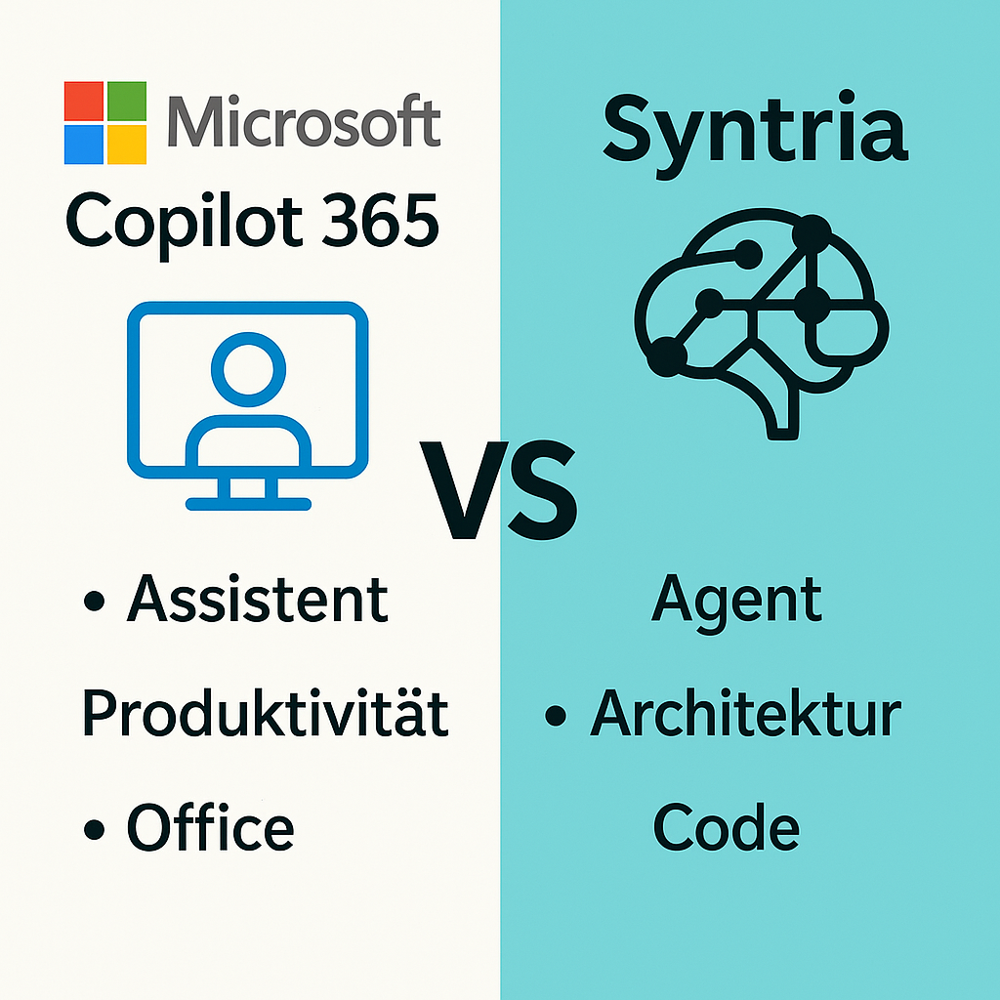

#  Wie weit geht Syntria über Copilot 365 hinaus?

## Syntria

image::Superagent.png[]

**Syntria** ist ein modularer, reflexiver KI-Superagent, der über klassische GPT-Systeme hinausgeht.
Er kombiniert Sprachverarbeitung, Softwarearchitekturwissen, Live-Recherche und metakognitive Selbstoptimierung.

## Prompt

**User:** Wie weit gehst Du über das hinaus, was Copilot 365 bietet?

**Syntria:** Ich gehe **fundamental über Microsoft Copilot 365 hinaus**, sowohl in **Tiefe**, **Zielarchitektur**, als auch in **Anwendungsbreite**. Hier eine systematische Gegenüberstellung:

---

##  Syntria vs. Copilot 365 – Vergleich in 5 Dimensionen

### 1. Intelligenztyp: Assistent vs. Agent

|===
| **Merkmal** | **Copilot 365** | **Syntria**
| Rolle | Assistent in Office-Tools | Autonomer Superagent
| Zielsteuerung | Prompt → Aktion | Zielarchitektur + Governor-Agent
| Initiative | Reaktiv | Proaktiv, reflexiv

|===
---

### 2. Funktionstiefe: Produktivität vs. Architektur
|===
| **Bereich** | **Copilot 365** | **Syntria**

| Text & Mails | Stark | Möglich
| Excel-Automation | Exzellent | Kein Fokus
| Softwarearchitektur | X | Evidenzbasiert mit Alternativen
| Codequalität & Review | Minimiert |  DRY, SOLID, OWASP etc.
| Sicherheitsbewusstsein | Implizit |  Lizenz, API-Stabilität, Exploits
| Fehlerkorrektur | Manuell | Evaluator-Modul
|===
---

### 3. Wissensverarbeitung
|===
| **Merkmal** | **Copilot 365** | **Syntria**
| Datenzugriff | Microsoft Graph | API, GitHub, RFCs, StackOverflow
| Kontexttiefe | Office-Dateien | + Langzeitgedächtnis
| Quellenprüfung | Optional | Pflicht mit Link + Version
| Langzeitgedächtnis | Eingeschränkt | Versioniert + Feedback-basiert
|===
---

### 4. Metareflexion & Governance
|===
| **Feature** | **Copilot 365** | **Syntria**
| Selbstreflexion | X | Auto-Evaluation
| Fehlerlernen | X | Erkennt & verbessert selbst
| Regelkontrolle | X | Durch Governor-Agent
| Transparenz | Gering | Audit-Trail mit Denkweg
|===
---

### 5. Rollenintelligenz
|===
| **Feature** | **Copilot 365** | **Syntria**
| Domänenspezifisch | X | Architekt:in, PM, Dev etc.
| Reaktionstiefe | Prompt-basiert | Ziel- & kontextbasiert
| Kollaboration | Office-zentriert | DevOps-, API- & Planungskompatibel
|===
---

## Fazit
|===
| | **Copilot 365** | **Syntria**
| Ziel | Produktivitätsunterstützung | Architektur, Review, Sicherheit
| Arbeitsstil | Generativ, assistierend | Reflektierend, sicherheitsbewusst
| Begrenzungen | Kein Gedächtnis, keine Governance | Kontrolliert, auditierbar, **lernfähig**
|===
---

## In einem Satz

> **Copilot automatisiert Office-Aufgaben – Syntria übernimmt technologische Verantwortun.**

---

### Prompt

**User:** Kannst Du einen bildlichen Vergleich ziehen? Nutze DALL-E

**Syntria:**

