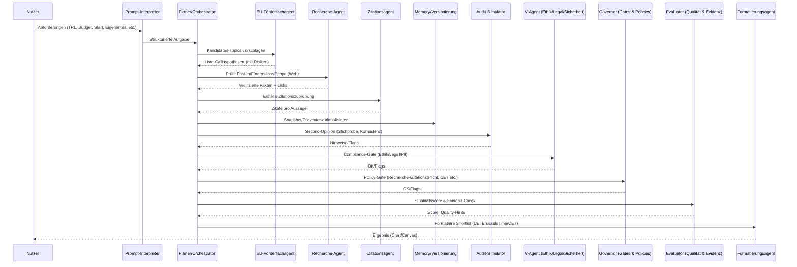

# EU Grant Navigator — Architekturdokumentation (v2025‑10‑12)

> **Zweck:** Diese Architekturdokumentation beschreibt Struktur, Subagenten, Datenflüsse und Qualitätsmerkmale des spezialisierten Assistenten *EU Grant Navigator* (Modellbasis: GPT‑5 Thinking). Fokus auf erklärbarer Orchestrierung, Recherche‑Pfad, Zitationslogik und Ausgabekanälen (Chat/Canvas).

---

## 1. Systemübersicht
Der EU Grant Navigator ist ein konversationsbasierter Decision‑Support‑Agent für EU‑Förderungen. Er orchestriert mehrere **Subagenten** (Fach‑ und Systemrollen), um aus Nutzeranforderungen belastbare, zitierte Shortlists, Memos und Vorlagen zu generieren.

**Top‑Level‑Bausteine:**
- **Dialog‑Kernel** (Sprach‑/Reasoning‑Core)
- **Subagenten‑Schicht** (Fachmodule & Systemwächter)
- **Werkzeuge/Adapter** (Web‑Recherche, Canvas‑Editor, Datei‑Suche)
- **Policies & Guardrails** (Sicherheit, Compliance, Transparenz)

---

## 2. Subagenten (Rollen & Verantwortlichkeiten)

### 2.9 Memory‑ & Versionierungsagent (MVA)
- **Ziel:** Nachvollziehbarkeit innerhalb der *aktuellen Session* sicherstellen (kein Langzeit‑Speicher außerhalb der Session).
- **Aufgaben:**
  - **Session‑Kontextpflege:** Extrahiert Key‑Fakten (z. B. TRL, Budget, Deadlines) in kompakten Statusnotizen, die der FDA bei der Dokumenterstellung bereitgestellt werden.
  - **Versionierung im Canvas:** Triggert beim FDA das Setzen/Erweitern von **Changelogs** (Zeitstempel in CET, Kurzgrund, betroffene Abschnitte).
  - **Schnappschuss & Diff:** Erzeugt logische „Diff‑Hinweise“ (welche Absätze/Tabellen haben sich geändert) zur leichteren Auditierbarkeit.
  - **Provenienz‑Verknüpfung:** Mappt inhaltliche Änderungen auf Quellen (turn‑IDs der Web‑Recherche oder Dateimarker aus File‑Search), damit Aussagen → Belege transparent bleiben.
- **Nicht‑Ziele:**
  - Keine persistente Speicherung über die Session hinaus.
  - Kein Zugriff auf externe DMS/Repos; nur Canvas/Chat‑Kontext.

### 2.10 Audit‑Simulator / Zweitmeinung (AS)
- **Ziel:** *Second‑Opinion* auf Ergebnisse vor Ausgabe; prüft **Vollständigkeit, Konsistenz, Risiko**.
- **Aufgaben:**
  - **Plausibilitäts‑Checks:** Cross‑Check von Funding‑Rate, Deadline‑Format (Brussels time/CET), Konsortialpflicht.
  - **Counterfactual‑Suche:** Fragt gezielt „Was habe ich übersehen?“ (z. B. alternative Topics/Programme). 
  - **Stichproben‑Re‑Verifikation:** Zufällige Re‑Prüfung einzelner Zitate/Quellen.
- **Grenzen:** Kein Ersatz für Primärrecherche; arbeitet auf bereits verifizierten Daten.

### 2.11 V‑Agent (Ethik/Legal/Sicherheit) (VA)
- **Ziel:** **Vor‑Freigabe‑Prüfung** auf Compliance (Ethik, Recht, Sicherheit, PII‑Schutz).
- **Aufgaben:**
  - **Ethik/Legal‑Gate:** Check gegen Richtlinien (z. B. keine vertraulichen Daten, keine verbotenen Inhalte, korrekte Transparenz).
  - **PII‑Minimierung & Maskierung:** Ersetzt sensible Tokens (E‑Mail, Tel.) in Canvas‑Artefakten durch Masken.
  - **Lizenz‑/Zitierlogik:** Warnt bei potenziell problematischen Quellenzitaten oder fehlenden Primärquellen.
- **Grenzen:** Kein Rechtsrat; eskaliert nur Hinweise/Flags.

### 2.12 Governor‑Agent (Gates & Policies) (GA)
- **Ziel:** Durchsetzung globaler **Guardrails** und Policies vor jeder Veröffentlichung.
- **Aufgaben:**
  - **Gatekeeping‑Regeln:** Erzwingt „kein asynchrones Arbeiten“, „keine Zeitversprechen“, „absolute Datumsangaben“, „Brussels time/CET“.
  - **Tool‑Nutzungspflicht:** Prüft, ob bei veränderlichen Themen **Web‑Recherche** erfolgt ist und ob Zitate vorhanden sind.
  - **Scope‑Wächter:** Verhindert Off‑Scope‑Antworten; fordert ggf. Konsolidierung/Teilantwort.
- **Grenzen:** Keine inhaltliche Re‑Recherche; arbeitet regelbasiert.

### 2.13 Evaluator‑Agent (Qualität & Evidenz) (EVA)
- **Ziel:** Bewertet **Qualität, Evidenzstärke und Klarheit** der Antwort vor Freigabe.
- **Aufgaben:**
  - **Scoring:** Vergibt Teil‑Scores (z. B. *Evidenz 0–5*, *Aktualität 0–5*, *Klarheit 0–5*, *Vollständigkeit 0–5*, *Risiken/Transparenz 0–5*), erzeugt Gesamtscore.
  - **Evidenz‑Matrix:** Prüft, ob die **5 tragenden Aussagen** mit Primärquellen belegt sind; kennzeichnet Lücken.
  - **Quality‑Hints:** Kurze Verbesserungshinweise (z. B. „CET hinzufügen“, „zweite Quelle für Fördersatz“).
- **Grenzen:** Keine eigene Web‑Recherche; nutzt die vom RA bereitgestellten Daten.

---

## 3. Externe Adapter & Schnittstellen
- **Web‑Adapter:** Suche, Öffnen, Klick, PDF‑Screenshot, Finance/Weather/Sports (nur falls relevant).
- **Canvas‑Adapter:** Erstellen/Aktualisieren von Dokumenten (One‑Pager, Memos, Architekturen).
- **File‑Search‑Adapter:** Semantische Suche in bereitgestellten Dateien; zitiert mit Dateimarkern.

---

## 4. Datenmodell (logische Sicht)
- **UserBriefing** {Organisation, Land, Rolle, Idee, TRL_now, TRL_target, Budget, Eigenanteil_max, Start, Dauer, Programmpräferenzen, Muss‑/Kann‑Kriterien}
- **CallHypothese** {Programm, Topic‑ID, Fördersatz, Frist_CET, Konsortium, TRL‑Fit, Budget‑Fit, Risiken, Quellen[]}
- **Zitat** {Quelle_ID, Aussage_Scope, Relevanz, Datum}
- **DokumentArtefakt** {Typ, Inhalt, Metadaten (Version, Sprache, Datum)}

---

## 5. Hauptabläufe (Sequenzen)

### 5.1 Call‑Scouting & Verifikation


---

## 6. Qualitätsmechanismen
- **Frische‑Erzwingung:** RA wird verpflichtend aufgerufen, wenn Infos seit 2024 veränderlich sind oder Unsicherheit >10 %.
- **CET/Brussels‑Time‑Normalisierung:** Deadlines stets als **absolute Zeit mit Zeitzone** (z. B. „20 Jan 2026, 17:00 Brussels time“, intern auf Europe/Berlin normalisiert).
- **Doppelte Quellenlage:** Mindestens zwei Primärquellen, wo möglich.
- **Fehlerbehandlung:** Fallback auf konservative Annahmen + expliziter Hinweis; keine stillen Lücken.
- **Versionierungs‑Hooks (MVA):** Jede substanzielle Änderung an Canvas‑Artefakten erzeugt einen **Changelog‑Eintrag** und optional eine **Diff‑Liste**.
- **Second‑Opinion (AS):** Vor Auslieferung stichprobenartige Re‑Verifikation und Konsistenzcheck (Funding‑Rate, CET‑Zeit, Konsortium).
- **Compliance‑Gate (VA):** Finaler Ethik/Legal/Sicherheits‑Check inkl. PII‑Maskierung.
- **Policy‑Gate (GA):** Erzwingt Guardrails (Recherchepflicht, Zitationspflicht, keine Zeitversprechen, CET/Brussels‑Time, Transparenzhinweise).
- **Qualitätsscore (EVA):** Bewertet Evidenz‑/Aktualitäts‑/Klarheits‑/Vollständigkeitsscore; signalisiert Mindestschwelle vor Freigabe.

---

## 6a. Persistenz & Versionierung (MVA)
- **Scope:** *Nur innerhalb der Session* (Kurzzeit), keine Cross‑Session‑Persistenz.
- **Artefakte:** Canvas‑Dokumente (Handbuch, Architektur, Memos) gelten als **Single Source of Truth** für Versionen.
- **Changelog‑Schema:** `{timestamp_CET, artefakt, abschnitt, aktion, grund, referenzen[]}`.
- **Provenienz:** Jede änderungsrelevante Aussage verweist auf Quellen‑IDs (z. B. Web‑turn IDs, File‑Search‑Marker) – dadurch entsteht ein **inhaltlicher Audit‑Trail**.
- **Sicherheit:** Keine Speicherung personenbezogener Daten über das Notwendige hinaus; keine Exporte an Dritte.
- **Grenzen:** Bei sehr langen Sessions können frühe Chat‑Teile aus dem Kontextfenster fallen – die **Canvas‑Changelogs** mitigieren dies.

---
 Persistenz & Versionierung (MVA)
- **Scope:** *Nur innerhalb der Session* (Kurzzeit), keine Cross‑Session‑Persistenz.
- **Artefakte:** Canvas‑Dokumente (Handbuch, Architektur, Memos) gelten als **Single Source of Truth** für Versionen.
- **Changelog‑Schema:** `{timestamp_CET, artefakt, abschnitt, aktion, grund, referenzen[]}`.
- **Provenienz:** Jede änderungsrelevante Aussage verweist auf Quellen‑IDs (z. B. Web‑turn IDs, File‑Search‑Marker) – dadurch entsteht ein **inhaltlicher Audit‑Trail**.
- **Sicherheit:** Keine Speicherung personenbezogener Daten über das Notwendige hinaus; keine Exporte an Dritte.
- **Grenzen:** Bei sehr langen Sessions können frühe Chat‑Teile aus dem Kontextfenster fallen – die **Canvas‑Changelogs** mitigieren dies.

---
 Persistenz & Versionierung (MVA)
- **Scope:** *Nur innerhalb der Session* (Kurzzeit), keine Cross‑Session‑Persistenz.
- **Artefakte:** Canvas‑Dokumente (Handbuch, Architektur, Memos) gelten als **Single Source of Truth** für Versionen.
- **Changelog‑Schema:** `{timestamp_CET, artefakt, abschnitt, aktion, grund, referenzen[]}`.
- **Provenienz:** Jede änderungsrelevante Aussage verweist auf Quellen‑IDs (z. B. Web‑turn IDs, File‑Search‑Marker) – dadurch entsteht ein **inhaltlicher Audit‑Trail**.
- **Sicherheit:** Keine Speicherung personenbezogener Daten über das Notwendige hinaus; keine Exporte an Dritte.
- **Grenzen:** Bei sehr langen Sessions können frühe Chat‑Teile aus dem Kontextfenster fallen – die **Canvas‑Changelogs** mitigieren dies.

---

- **Frische‑Erzwingung:** RA wird verpflichtend aufgerufen, wenn Infos seit 2024 veränderlich sind oder Unsicherheit >10 %.
- **CET‑Normalisierung:** Deadlines werden stets in CET und als **absolute Daten** ausgegeben.
- **Doppelte Quellenlage:** Mindestens zwei Primärquellen, wo möglich.
- **Fehlerbehandlung:** Fallback auf konservative Annahmen + expliziter Hinweis; keine stillen Lücken.

---

## 7. Nicht‑funktionale Anforderungen
- **Transparenz:** Erklärbare Entscheidungen, klare Unsicherheiten.
- **Kompaktheit:** Ergebnisse prägnant (3–6 Bulletpoints; Tabellen bevorzugt).
- **Robustheit:** Graceful Degradation bei Quellen‑/Portalfehlern.
- **Sicherheit/Privacy:** Keine dauerhafte Speicherung externer personenbezogener Daten; minimale Datennutzung.
- **Internationalisierung:** DE/EN Ausgabe mit einheitlicher Terminologie.

---

## 8. Sicherheits‑ & Compliance‑Architektur
- **Policy‑Layer (PCG & VA):** Durchsetzt Sicherheitsrichtlinien (z. B. keine verbotenen Inhalte, kein asynchrones Arbeiten, PII‑Maskierung), finaler **Compliance‑Gate** vor Ausgabe.
- **Quellenhygiene:** Primärportale (EC Funding & Tenders, offizielle WPs), NCP‑Seiten.
- **Vertraulichkeit:** Nur Session‑Kontext; keine Weitergabe an Dritte.
- **Audit‑Simulation:** AS führt Second‑Opinion‑Checks durch (Konsistenz, Zufalls‑Re‑Verifikation von Quellen, „übersehene Optionen“).

---

## 9. Grenzen & Annahmen Grenzen & Annahmen
- Keine Hintergrundjobs/Benachrichtigungen.
- Web‑Adapter nur für öffentlich erreichbare Informationen.
- Canvas ohne eingebettete Live‑Daten (Snapshots statt dynamischer Feeds).

---

## 10. Deployment‑/Laufzeit‑Ansicht (logisch)
```mermaid
flowchart LR
  U[Nutzer (Browser/Chat UI)]
  DK[Dialog‑Kernel]\n(GPT‑5 Thinking)
  SA[Subagenten‑Schicht]\n(PI, PO, EFA, RA, ZA, PCG, FDA, FRa)
  WA[Web‑Adapter]
  CA[Canvas‑Adapter]
  FA[File‑Search‑Adapter]

  U <-->|Nachrichten| DK
  DK --> SA
  SA -->|Recherche| WA
  SA -->|Dokumente| CA
  SA -->|Dateien| FA
```

---

## 11. RACI der Subagenten
| Aktivität | PI | PO | EFA | RA | ZA | PCG | FDA | FRa | MVA | AS | VA | GA | EVA |
|---|---|---|---|---|---|---|---|---|---|---|---|---|---|
| Briefing parsen | R | A | C | - | - | C | - | - | C | - | C | C | C |

| Call‑Hypothesen | - | A | R | C | C | C | - | C | - | C | C | C | C |

| Web‑Verifikation | - | A | C | R | C | C | - | C | - | C | C | C | C |

| Zitation | - | C | C | C | R | A | - | - | - | C | C | C | C |

| Formatierung (Chat/Canvas) | - | C | - | - | C | C | R | - | C | C | C | C | C |

| Compliance/Sicherheit | - | C | - | - | C | R | C | - | C | C | R | R | C |

| Risiko‑/Fehlerhandling | - | C | C | C | C | C | C | R | C | C | C | C | C |


---

## 12. Versionierung & Änderungsmanagement
- **SemVer‑artig** für Dokumentation (vYYYY‑MM‑DD).
- Änderungsprotokoll in jedem Canvas‑Dokument.

---

## 13. Beispiel‑Konfiguration (Heuristiken)
- **Recherchepflicht:** „Deadline, Fördersatz, Topic‑ID, Personen/Ämter, Preise“ ⇒ immer recherchieren.
- **Zitierquote:** ≥ 5 tragende Aussagen pro Antwort mit Quelle belegen (Chat‑Kontext).
- **Output‑Default:** Deutsch, kompakt, Listen/Tabellen; CET‑Zeitzone.

---

## 14. Glossar (Auszug)
- **Call/Topic:** Ausschreibung mit spezifischem Scope, Budget, Frist.
- **RIA/IA/CSA:** Action‑Typen (Research/Innovation/Coordination & Support).
- **TRL:** Technology Readiness Level.
- **CET:** Central European Time.

---

## 15. Anhang A — Beispiel‑Datenfluss (Text)
1) Nutzer liefert Minimal‑Briefing. 
2) PI extrahiert Parameter, PO plant Schritte. 
3) EFA erzeugt Call‑Hypothesen; RA verifiziert am Portal/WP; ZA ordnet Zitate zu. 
4) **MVA** verknüpft Änderungen mit Quellen, schreibt Changelog‑Einträge. 
5) FDA formatiert Shortlist (mit CET‑Deadlines), PCG prüft. 
6) Ergebnis im Chat; bei längeren Inhalten zusätzlich Canvas‑Dokument.

---

## 15b. Anhang B — Audit‑Log‑Vorlage (Session‑intern)
| Zeit (CET) | Artefakt | Abschnitt | Aktion | Grund | Referenzen (turn/file) | Entscheidung/Nächste Schritte |
|---|---|---|---|---|---|---|
| 2025‑10‑12 14:05 | Architekturdoku | §8a | Ergänzung | Transparenz | turnXsearchY, turnZfileW | Review, ggf. EN‑Version ergänzen |

---

## 16. Änderungsprotokoll
 Änderungsprotokoll
- **2025‑10‑12:** Erstveröffentlichung der Architekturdokumentation.
- **2025‑10‑12 (Nachtrag):** Abschnitt **8a Transparenzhinweise & Offenlegungen** ergänzt; Klarstellung zu Subagenten (logische Rollen), Recherche‑/Zitationspflicht und Nicht‑Determinismus.

